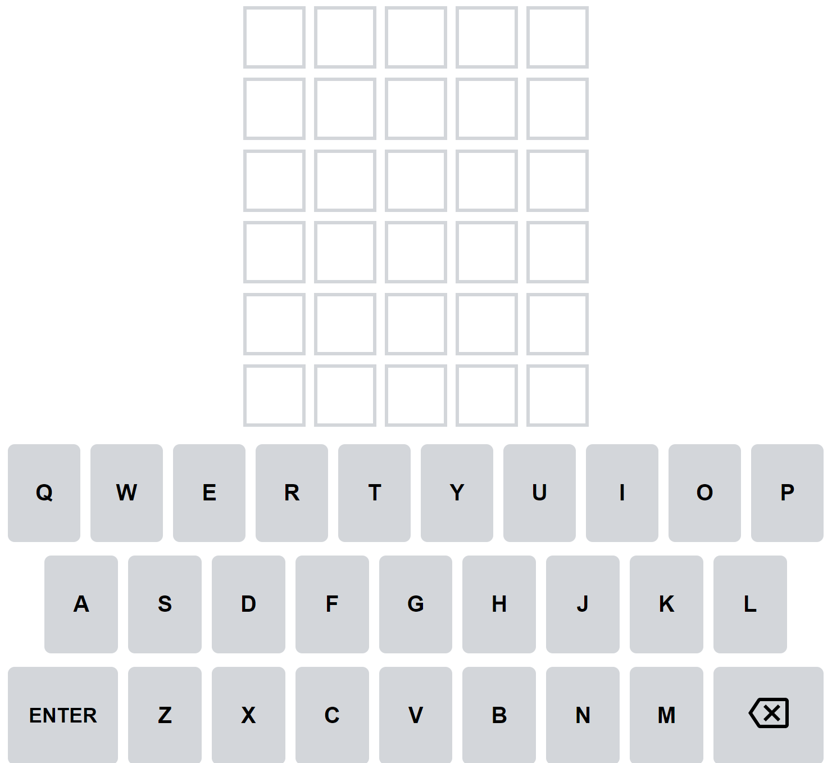
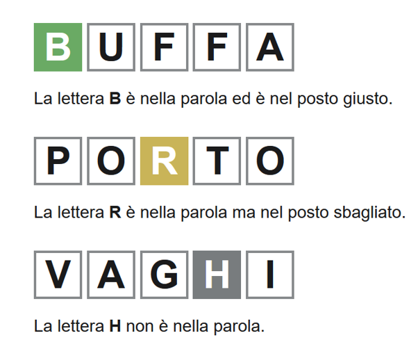
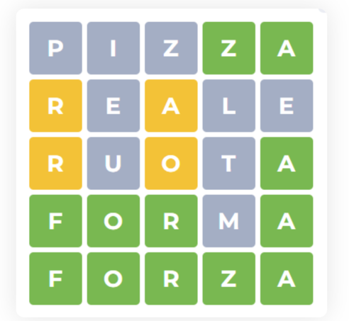
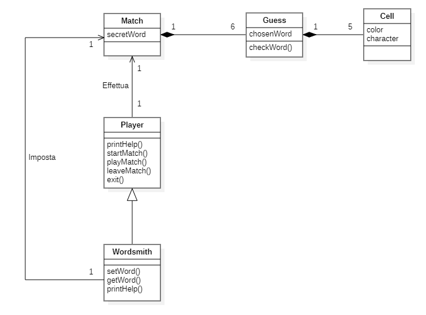

# Indice

<ul>
  <li><strong>1</strong>. Introduzione</li>
  <li><strong>2</strong>. Modello di dominio</li>
  <li><strong>3</strong>. Requisiti specifici</li>
    <ul>
    <li><strong>3.1.</strong> Requisiti funzionali</li>
    <li><strong>3.2.</strong> Requisiti non funzionali</li>
    </ul>
  </li>
  <li><strong>5</strong>. OO Design</li>
</ul>

---

## Introduzione

Wordle è un gioco di parole:
* Indovina una parola di 5 lettere in 6 tentativi
* Dopo ogni tentativo, i colori delle tessere cambieranno per mostrare il **feedback**

[Versione ufficiale in inglese](www.nytimes.com/games/wordle)  

### Variante:
* Interfaccia a linea di comando (CLI)
* Parole in lingua italiana 

---

## Modello di dominio

---

## Requisiti specifici

### Requisiti funzionali

<ul>
<li> 
<strong>Come giocatore voglio mostrare l'help con elenco comandi</strong> 

**_Criteri di accettazione_** 
Al comando **/help**  
o invocando l'app con flag _--help_ o _-h_

il risultato è una descrizione concisa, che normalmente appare all'avvio del programma, seguita dalla lista di comandi disponibili, uno per riga, come da esempio successivo: 
•	gioca 
•	esci 
•	... 
</li>

<li> 
<strong>Come giocatore voglio iniziare una nuova partita</strong> 

**_Criteri di accettazione_** 
Al comando **/gioca** 

se nessuna partita è in corso l'app mostra la matrice dei tentativi vuota, ma senza mostrare la tastiera, e si predispone a ricevere il primo tentativo o altri comandi.
</li>

<li> 
<strong>Come giocatore voglio abbandonare la partita</strong> 

**_Criteri di accettazione_** 
Al comando **/abbandona** 

l'app chiede conferma 
• se la conferma è positiva, l'app comunica l’abbandono 
• se la conferma è negativa, l'app si predispone a ricevere un altro tentativo o altri comandi 
</li>

<li> 
<strong>Come giocatore voglio chiudere il gioco</strong> 

**_Criteri di accettazione_** 
Al comando **/esci** 

l'applicazione chiede conferma 
• se la conferma è positiva, l'app si chiude restituendo un _zero exit code_ 
• se la conferma è negativa, l'app si predispone a ricevere nuovi tentativi o comandi 
</li>

<li> 
<strong>Come giocatore voglio effettuare un tentativo per indovinare la parola segreta</strong> 

**_Criteri di accettazione_** 
Digitando caratteri sulla tastiera e invio l’applicazione risponde: 
• _Tentativo incompleto_ se i caratteri sono inferiori a quelli della parola segreta 
• _Tentativo eccessivo_ se i caratteri sono superiori a quelli della parola segreta 
• _Tentativo non valido_ se ci sono caratteri che non corrispondono a lettere dell’alfabeto 

altrimenti

riempiendo la prima riga libera della matrice dei tentativi con i caratteri inseriti e colorando lo sfondo di verde se la lettera è nella parola segreta e nel posto giusto, di giallo se la lettera è nella parola segreta ma nel posto sbagliato e di grigio se la lettera non è nella parola segreta. 

Se le lettere sono tutte verdi l’applicazione risponde 
• _Parola segreta indovinata_ 
_Numero tentativi: <…>_ 
e si predispone a nuovi comandi

Se il tentativo fallito è l’ultimo possibile , l’applicazione risponde 
• _Hai raggiunto il numero massimo di tentativi._ 
_La parola segreta è <…>_  
e si predispone a nuovi comandi

Se la parola segreta non è stata impostata l’applicazione risponde 
_Parola segreta mancante_ 
</li>

<li> 
<strong>Come paroliere voglio impostare una parola segreta manualmente</strong> 

**_Criteri di accettazione_** 
Al comando **/nuova** _\<parola>_

l’applicazione risponde: 
• _Parola segreta troppo corta_ se i caratteri sono inferiori a quelli del gioco 
• _Parola segreta troppo lunga_ se i caratteri sono superiori a quelli del gioco 
• _Parola segreta non valida_ se ci sono caratteri che non corrispondono a lettere dell’alfabeto 

altrimenti

l’applicazione risponde con _OK_ e memorizza la parola fino a chiusura applicazione.

È possibile cambiare la parola durante una sessione di gioco anche senza uscire dall’applicazione. 
</li>

<li> 
<strong>Come paroliere voglio mostrare la parola segreta</strong> 

**_Criteri di accettazione_** 
Al comando **/mostra**

l’applicazione risponde visualizzando la parola segreta 
</li>
</ul>

### Requisiti non funzionali
<ul>
<li> 
<strong>Il container docker dell'app deve essere eseguito da terminali che supportano Unicode con encoding UTF-8 o UTF-16</strong> 
Elenco di terminali supportati 
Linux: 
- terminal 
Mac OS 
- terminal 
Windows 
- Powershell 
- Git Bash (in questo caso il comando Docker ha come prefisso winpty; es: winpty docker -it ....) 

Comando per l’esecuzione del container 
Dopo aver eseguito il comando docker pull copiandolo da GitHub Packages, il comando Docker da usare per eseguire il container contenente l’applicazione è: 

`docker run --rm -it ghcr.io/softeng2122-inf-uniba/wordle-floyd:latest`

</li>
</ul>

---

## OO Design

### Come giocatore voglio mostrare l'help con elenco comandi (#20)

Diagramma di sequenza se viene invocato /help fuori dalla partita

Diagramma di sequenza se viene invocato /help dentro alla partita

---

### Come giocatore voglio iniziare una nuova partita (#21)

---

### Come paroliere voglio impostare una parola segreta manualmente (#18)

---

### Come 