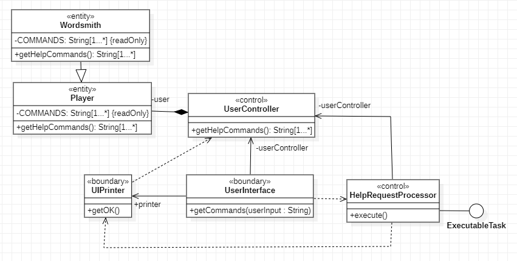
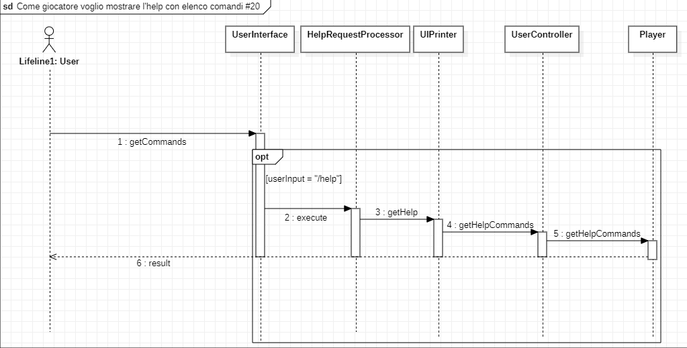
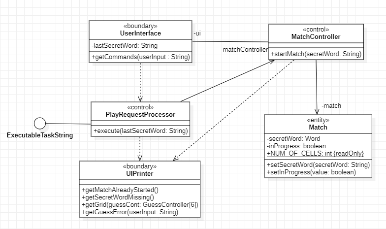
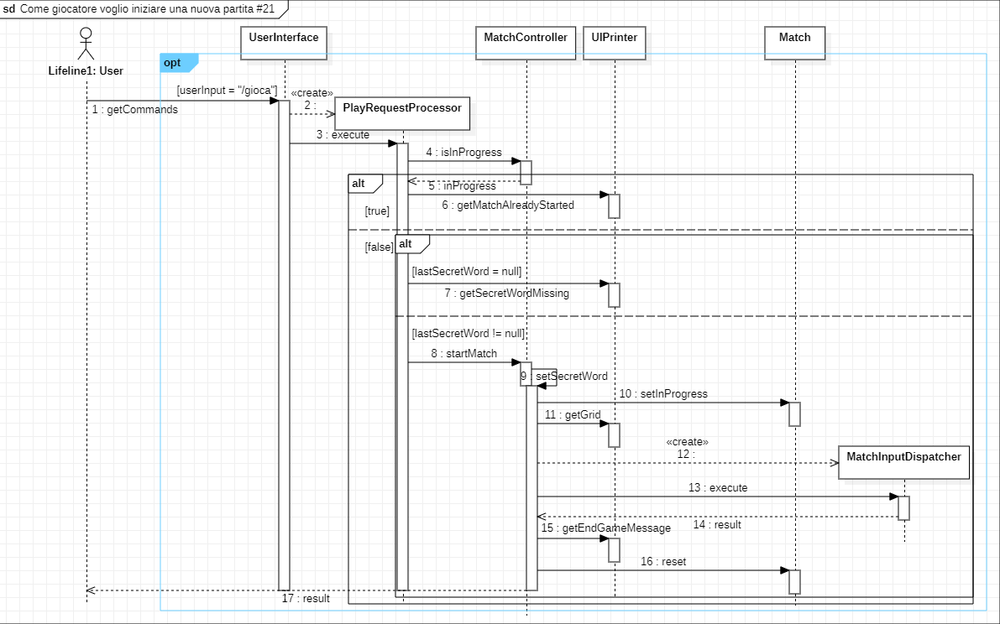
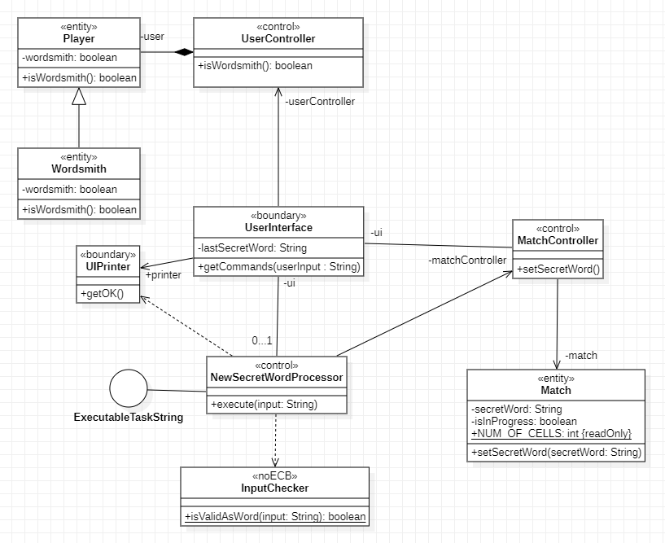
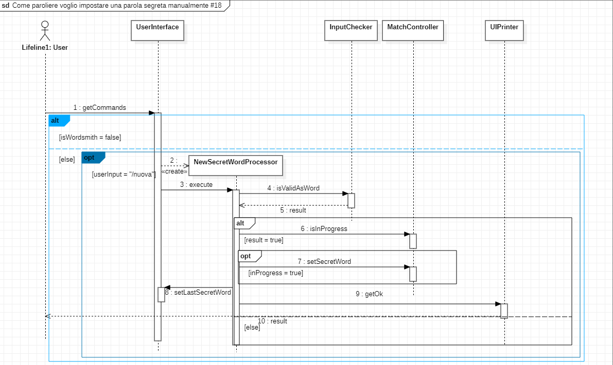
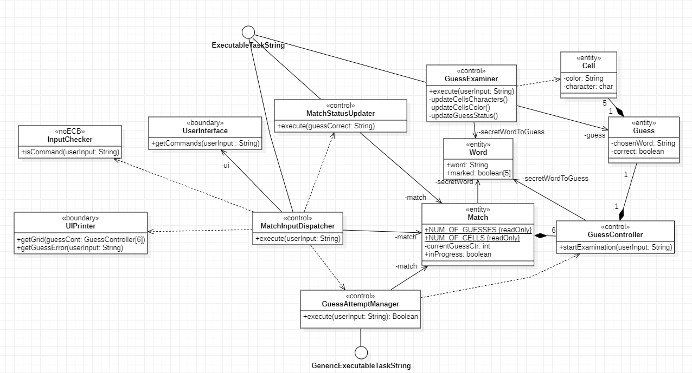
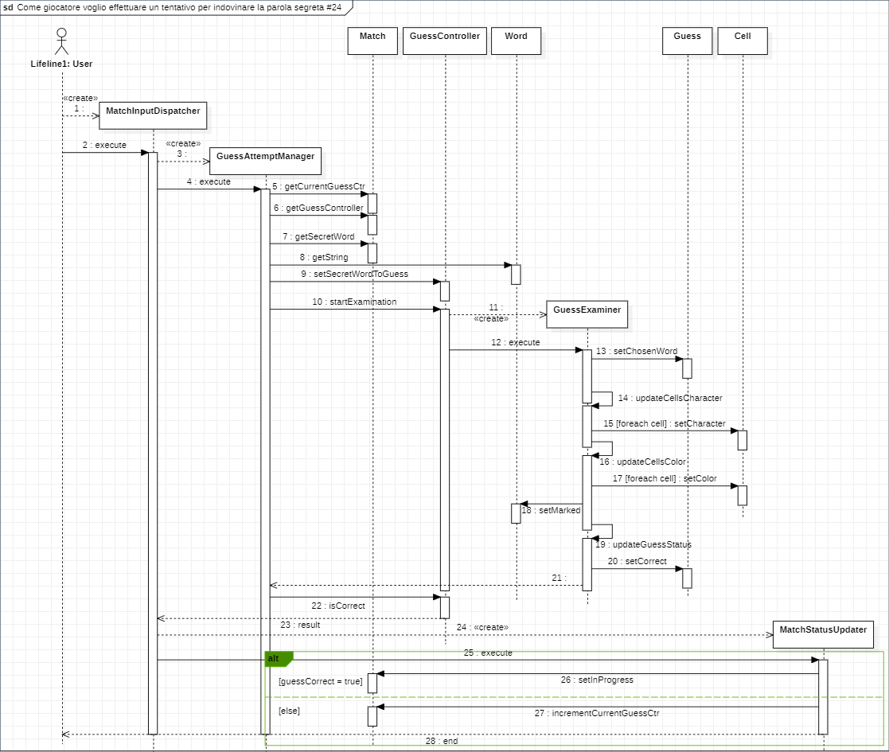
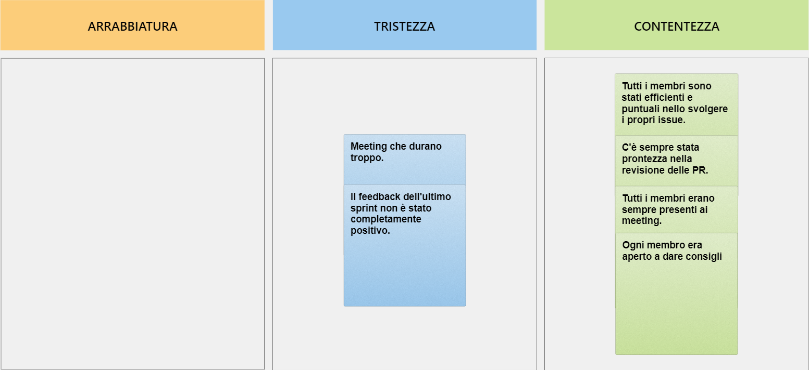

# Indice

<ul>
  <li><strong>1</strong>. Introduzione</li>
  <li><strong>2</strong>. Modello di dominio</li>
  <li><strong>3</strong>. Requisiti specifici</li>
    <ul>
    <li><strong>3.1.</strong> Requisiti funzionali</li>
    <li><strong>3.2.</strong> Requisiti non funzionali</li>
    </ul>
  </li>
  <li><strong>5</strong>. OO Design</li>
</ul>

---

## Introduzione

Wordle è un gioco di parole:
* Indovina una parola di 5 lettere in 6 tentativi
* Dopo ogni tentativo, i colori delle tessere cambieranno per mostrare il **feedback**

[Versione ufficiale in inglese](www.nytimes.com/games/wordle)  

### Variante:
* Interfaccia a linea di comando (CLI)
* Parole in lingua italiana 

---

## Modello di dominio

---

## Requisiti specifici

### Requisiti funzionali

<ul>
<li> 
<strong>Come giocatore voglio mostrare l'help con elenco comandi</strong> 

**_Criteri di accettazione_** 
Al comando **/help**  
o invocando l'app con flag _--help_ o _-h_

il risultato è una descrizione concisa, che normalmente appare all'avvio del programma, seguita dalla lista di comandi disponibili, uno per riga, come da esempio successivo: 
•	gioca 
•	esci 
•	... 
</li>

<li> 
<strong>Come giocatore voglio iniziare una nuova partita</strong> 

**_Criteri di accettazione_** 
Al comando **/gioca** 

se nessuna partita è in corso l'app mostra la matrice dei tentativi vuota, ma senza mostrare la tastiera, e si predispone a ricevere il primo tentativo o altri comandi.
</li>

<li> 
<strong>Come giocatore voglio abbandonare la partita</strong> 

**_Criteri di accettazione_** 
Al comando **/abbandona** 

l'app chiede conferma 
• se la conferma è positiva, l'app comunica l’abbandono 
• se la conferma è negativa, l'app si predispone a ricevere un altro tentativo o altri comandi 
</li>

<li> 
<strong>Come giocatore voglio chiudere il gioco</strong> 

**_Criteri di accettazione_** 
Al comando **/esci** 

l'applicazione chiede conferma 
• se la conferma è positiva, l'app si chiude restituendo un _zero exit code_ 
• se la conferma è negativa, l'app si predispone a ricevere nuovi tentativi o comandi 
</li>

<li> 
<strong>Come giocatore voglio effettuare un tentativo per indovinare la parola segreta</strong> 

**_Criteri di accettazione_** 
Digitando caratteri sulla tastiera e invio l’applicazione risponde: 
• _Tentativo incompleto_ se i caratteri sono inferiori a quelli della parola segreta 
• _Tentativo eccessivo_ se i caratteri sono superiori a quelli della parola segreta 
• _Tentativo non valido_ se ci sono caratteri che non corrispondono a lettere dell’alfabeto 

altrimenti

riempiendo la prima riga libera della matrice dei tentativi con i caratteri inseriti e colorando lo sfondo di verde se la lettera è nella parola segreta e nel posto giusto, di giallo se la lettera è nella parola segreta ma nel posto sbagliato e di grigio se la lettera non è nella parola segreta. 

Se le lettere sono tutte verdi l’applicazione risponde 
• _Parola segreta indovinata_ 
_Numero tentativi: <…>_ 
e si predispone a nuovi comandi

Se il tentativo fallito è l’ultimo possibile , l’applicazione risponde 
• _Hai raggiunto il numero massimo di tentativi._ 
_La parola segreta è <…>_  
e si predispone a nuovi comandi

Se la parola segreta non è stata impostata l’applicazione risponde 
_Parola segreta mancante_ 
</li>

<li> 
<strong>Come paroliere voglio impostare una parola segreta manualmente</strong> 

**_Criteri di accettazione_** 
Al comando **/nuova** _\<parola>_

l’applicazione risponde: 
• _Parola segreta troppo corta_ se i caratteri sono inferiori a quelli del gioco 
• _Parola segreta troppo lunga_ se i caratteri sono superiori a quelli del gioco 
• _Parola segreta non valida_ se ci sono caratteri che non corrispondono a lettere dell’alfabeto 

altrimenti

l’applicazione risponde con _OK_ e memorizza la parola fino a chiusura applicazione.

È possibile cambiare la parola durante una sessione di gioco anche senza uscire dall’applicazione. 
</li>

<li> 
<strong>Come paroliere voglio mostrare la parola segreta</strong> 

**_Criteri di accettazione_** 
Al comando **/mostra**

l’applicazione risponde visualizzando la parola segreta 
</li>
</ul>

### Requisiti non funzionali
<ul>
<li> 
<strong>Il container docker dell'app deve essere eseguito da terminali che supportano Unicode con encoding UTF-8 o UTF-16</strong> 
Elenco di terminali supportati 
Linux: 
- terminal 
Mac OS 
- terminal 
Windows 
- Powershell 
- Git Bash (in questo caso il comando Docker ha come prefisso winpty; es: winpty docker -it ....) 

Comando per l’esecuzione del container 
Dopo aver eseguito il comando docker pull copiandolo da GitHub Packages, il comando Docker da usare per eseguire il container contenente l’applicazione è: 

`docker run --rm -it ghcr.io/softeng2122-inf-uniba/wordle-floyd:latest`

</li>
</ul>

---

## OO Design

### Come giocatore voglio mostrare l'help con elenco comandi (#20)

#### Diagrammi allo stato dello sprint 1

Diagramma di sequenza se viene invocato /help fuori dalla partita

Diagramma di sequenza se viene invocato /help dentro alla partita

#### Diagrammi allo stato dello sprint 2

---

### Come giocatore voglio iniziare una nuova partita (#21)

#### Diagrammi allo stato dello sprint 1

#### Diagrammi allo stato dello sprint 2

---

### Come paroliere voglio impostare una parola segreta manualmente (#18)

#### Diagrammi allo stato dello sprint 1

#### Diagrammi allo stato dello sprint 2

---

### Come giocatore voglio effettuare un tentativo per indovinare la parola segreta (#24)

#### Diagrammi allo stato dello sprint 1

#### Diagrammi allo stato dello sprint 2

### Decisioni prese

Per quanto riguarda alcune entità, ritenute più vulnerabili in quanto gestite da più controller contemporaneamente, abbiamo optato per un meccanismo di get e set attraverso l'ausilio di deep copy, ovvero la copia completa di oggetti volta ad evitare eventuali effetti collaterali e ad aumentarne, quindi, la sicurezza. 
Quindi, i getter dei vari oggetti restituiranno una copia dell'oggetto in questione e non il riferimento ad esso.
Per poter, quindi, confermare e salvare eventuali modifiche, si dovrà ricorrere al setter, il quale effettua un'ulteriore copia che separa il parametro effettivo dal nuovo oggetto "reale" memorizzato nell'entità.

#### **CheckStyle main**

Sono stati ignorati i warning relativi alla lunghezza della riga superiore a 80 caratteri, in quanto avrebbero portato a una frammentazione visiva dell'effettivo codice, introducendo quindi, effetti da noi ritenuti negativi sulla leggibilità dello stesso. 
È stato inoltre tralasciato il warning riguardante la nomenclatura della variabile "printer" che, secondo i principi di Checkstyle, dovrebbe avere la nomenclatura in maiuscolo in quanto variabile statica e costante; tuttavia abbiamo ritenuto che fosse più corretta, per il suo scopo, la nomenclatura in minuscolo.

#### **CheckStyle test**

Sono stati nuovamente ignorati i warning relativi alla lunghezza della riga per le medesime motivazioni sopracitate. 
Inoltre, sono presenti warning riguardanti la nomenclatura dei metodi che, secondo i principi di Checkstyle, non dovrebbe contenere underscore ("_"); tuttavia, le convenzioni di JUnit e Java, permettono l'utilizzo degli underscore nella nomenclatura dei metodi di test. 
Infine, ignoriamo un gruppo di warning riguardante la classe ExitAssertions.java, in quanto libreria esterna.

#### **SpotBugs main**

È presente un warning sull'utilizzo del System.exit() che, secondo i principi di SpotBugs, è una "Bad practice", permessa esclusivamente laddove ritenuta appropriata, come nel nostro caso, in quanto requisito funzionale. 
Infine, è presente un gruppo di warning riguardante i vari controller, che conservano riferimenti a oggetti esterni mutabili, esponendo la loro rappresentazione interna; tuttavia è un comportamento intenzionale, in quanto sono i controller che gestiscono lo stato interno delle entità.

---

## 6. Riepilogo del test

---

## 7. Manuale utente

I comandi disponibili come **paroliere** sono i seguenti: 
• /gioca 
• /abbandona 
• /mostra 
• /nuova \<parola> 

I comandi disponibili come **giocatore** sono i seguenti: 
• /gioca 
• /abbandona 

Per iniziare una nuova partita, il paroliere deve prima aver impostato una parola segreta tramite il comando **/nuova \<parola\>** 
Le parole valide contengono 5 caratteri alfabetici. 
Una volta impostata la parola segreta sarà possibile eseguire il comando **/gioca** che permetterà di giocare una nuova partita con l'ultima parola segreta impostata. 
Il comando **/gioca** è utilizzabile solo fuori dalla partita. 

Il comando **/nuova \<parola>** è utilizzabile anche durante la partita, difatti, la parola segreta verrà aggiornata in tempo reale.

Qualora il paroliere volesse mostrare la parola segreta attualmente impostata, dovrebbe usare il comando **/mostra**

Se il giocatore (o paroliere) volesse abbandonare la partita in corso, dovrebbe usare il comando **/abbandona** 
Il comando **/abbandona** è utilizzabile solo durante una partita.

### Come effettuare un tentativo durante la partita
Una volta iniziata la partita, il gioco mostrerà una griglia vuota, composta da 6 righe (tentativi) e 5 colonne (lettere del tentativo). 
Per effettuare un tentativo basterà inserire in input la parola con cui si vuole, appunto, effettuare il tentativo. 
È permesso l'utilizzo dei comandi durante la partita.

---

## 8. Processo di sviluppo e organizzazione del lavoro

Abbiamo preferito lavorare ad un issue per volta, in quanto abbiamo ritenuto che diversi issues fossero strettamente correlati tra loro, impedendone, quindi, lo sviluppo parallelo. 
Solitamente ogni issue è stato assegnato ad un singolo componente del gruppo, mentre issue più complessi sono stati assegnati ad al più due componenti ed è stata richiesta la partecipazione di tutto il team per quanto riguarda il processo di review. 
Sono stati effettuati meeting periodici prima dell'inizio di ogni sprint e dopo la loro conclusione e, nel caso di issues più complessi, anche meeting di revisione extra, in cui si è discusso del lavoro svolto e degli eventuali problemi riscontrati.

---

## 9. Analisi retrospettiva
### 9.1 Sprint 1

